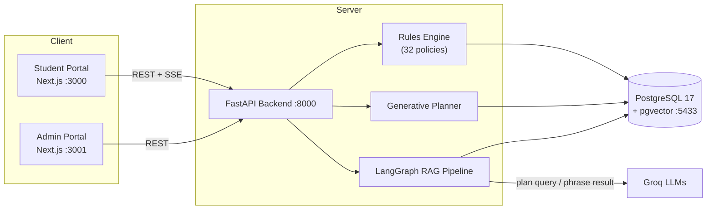

<div align="center">

# 🎓 AIU Academic Advisor

### An AI-powered academic advising platform for Al Alamein International University

*A deterministic rules engine **computes**; a large language model **narrates**.*

[](https://nextjs.org/)
[](https://react.dev/)
[](https://fastapi.tiangolo.com/)
[](https://www.postgresql.org/)
[](https://www.langchain.com/langgraph)
[](https://tailwindcss.com/)

</div>

---

## 📖 Overview

**AIU Academic Advisor** is a full-stack university platform that helps students of the **Artificial Intelligence Science (AIS)** program plan their degree, monitor their academic standing, simulate their GPA, and talk to an AI advisor that is *grounded in the official university rulebook* — never making numbers up.

It is built as three cooperating services around a single PostgreSQL database:

| Service | Stack | Port | Purpose |
|---|---|---|---|
| **Student Portal** | Next.js 16 · React 19 · Tailwind v4 | `:3000` | Dashboard, transcript, GPA simulator, course registration, AI chat advisor, degree planner |
| **Admin Portal** | Next.js 16 (`admin-ui/`) | `:3001` | RBAC + audit control over students, grades, courses, finances, business rules, and an AI admin assistant |
| **Backend API** | FastAPI · SQLAlchemy (async) | `:8000` | REST API, rules engine, generative planner, and the RAG chatbot pipeline |
| **Database** | PostgreSQL 17 + `pgvector` (Docker) | `:5433` | Relational data **and** vector embeddings for retrieval |

---

## 🧭 Design philosophy — *“the rules engine computes, the LLM narrates”*

The core thesis of this project is **trustworthy academic AI**:

> **No number the AI shows is generated by the language model.** Every CGPA, credit count, graduation date, registration priority, and risk estimate is **queried or computed deterministically from PostgreSQL through the rules engine.** The LLM only *plans which query to run* and *phrases the result* in natural language.

This makes every AI answer **defensible** — you can always trace it back to a row in the database or a clause in the rulebook.

---

## ✨ Key Features

### 🤖 AI Academic Advisor (RAG chatbot)
- Answers student questions using **their real academic record** + the **university rulebook** (retrieved via `pgvector` similarity search).
- **Citations** — every policy answer shows its source documents.
- **Persistent memory** — conversations survive page navigation, with a history drawer of past chats.
- **Bilingual** — responds in English or Modern Standard Arabic depending on the UI language.
- Powered by **LangGraph** orchestration + **Groq** LLMs.

### 📅 Generative Degree Planner
- Builds a **term-by-term roadmap** to graduation, in two modes: **Normal** (balanced load) and **Fastest** (summers + overload).
- **Feasibility proof** — mathematically proves the earliest possible graduation term (e.g. *“83 CH remain vs a legal max of 82 by Fall 2027 → Spring 2028 is provably optimal”*).
- **Academic profiling** — detects a student’s weak/strong subject areas vs. the cohort and shapes a lighter “focus load” around hard courses.
- **4-tier registration priority** + tiered waitlist, **risk projections** (expected failures, realistic graduation term), and prerequisite-chain criticality.

### ⚖️ Business Rules Engine
- **32 admin-editable policies** across academic standing, enrollment, finance, retakes, petitions, and capstone — aligned clause-for-clause with the official rulebook.
- Rules are read at request time, so changing a policy in the admin portal **takes effect instantly** (e.g. edit the at-risk CGPA threshold → the dashboard count updates live).
- Implements the full **warning → probation → dismissal** state machine, the **semester-indexed credit-limit ladder**, and **summer-recovery** logic.

### 🛡️ Admin Portal
- **Role-based access control** (`super_admin` / `registrar` / `read-only`) enforced server-side, with a complete **audit trail** of every change (before → after diffs).
- Manage students, grades (auto-recompute CGPA), courses & sections, course offerings (schedule builder), finances, approvals, and announcements.
- **AI Admin Assistant** — natural-language data queries over real SQL + a real-data anomaly scanner.
- **Staff management** — super-admins create/deactivate other admins (with self-lockout guards).

### 🎨 Experience
- Full **dark mode** and **Arabic / RTL** internationalization across every page.
- Motion design with Framer Motion; a decorative 3D element via React Three Fiber.

---

## 🏗️ Architecture



**Request flow:** the client calls the backend → the rules engine and planner compute deterministic results from PostgreSQL → for chat, the RAG pipeline retrieves student context + rulebook chunks from `pgvector` and asks Groq only to *phrase* the computed answer, streamed back over SSE.

---

## 🧰 Tech Stack

| Layer | Technologies |
|---|---|
| **Frontend** | Next.js 16 (App Router), React 19, Tailwind CSS v4, Radix UI, Framer Motion, React Three Fiber, react-markdown + remark-gfm |
| **Backend** | FastAPI, SQLAlchemy (async), asyncpg, Pydantic, JWT auth (bcrypt) |
| **Database** | PostgreSQL 17 + `pgvector` (vector embeddings), run via Docker Compose |
| **AI / RAG** | LangGraph (orchestration), Groq (`llama-3.3-70b-versatile` + `llama-3.1-8b-instant`), sentence-transformers embeddings (384-dim) |
| **Tooling** | Docker, npm, Python venv |

---

## 📂 Project Structure

```
advisor-ui/
├── src/                      # Student portal (Next.js App Router)
│   ├── app/                  #   pages: dashboard, academic-records, gpa-simulator,
│   │                         #   manage-classes, schedule-generator, profile, …
│   ├── components/           #   UI primitives, layout, ChatPanel, charts
│   ├── hooks/                #   useAuth, useTheme, useLanguage, usePageData
│   └── lib/                  #   api client, i18n dictionary, constants
├── admin-ui/                 # Admin portal (separate Next.js app, port 3001)
│   └── src/app/              #   dashboard, students, courses, offerings, rules,
│                             #   approvals, announcements, assistant, staff, audit
├── backend/                  # FastAPI service
│   ├── main.py               #   app entry + router mounting
│   ├── routers/              #   REST endpoints (auth, students, admin/*, chat, …)
│   ├── services/             #   rules engine, degree planner, standing, validation
│   ├── ai/                   #   LangGraph nodes, Groq client, embeddings
│   ├── models/               #   SQLAlchemy ORM models
│   ├── scripts/              #   data pipeline: migrate / generate / embed
│   ├── docker-compose.yml    #   PostgreSQL + pgvector
│   └── .env.example          #   environment template
├── public/                   # Static assets (AIU logo, etc.)
└── README.md
```

---

## 🎓 The Dataset

The system runs on a **synthetic but provably rule-clean** dataset, modeled on the official **AIS 4-year, 133-credit-hour study plan**:

- **63 courses** — 46 technical (Core / Major / Elective) + 17 university requirements (general education).
- **220 students** across 5 cohorts (entry years 2021–2025), where the student-code prefix encodes the entry year.
- **Plan-driven & cohort-coherent** — every student walks the official 8-semester study plan term-by-term, so the whole cohort *starts identically* (Year 1 is lockstep). Divergence comes only from grades, failures → retakes, elective choices, and edge-case profiles.
- **Full edge-case spectrum** for testing — the warning ladder (levels 1–4), probation, dismissal, summer recovery, math-0 failures, early graduates, retakes, and low-CGPA-still-active students.
- **Verified rule-clean** — 0 prerequisite violations and 0 CGPA-vs-standing drift; every transcript obeys the business rules.

> All transcripts are simulated through the **production rules engine**, so the data is internally consistent with the live system that serves it.

---

## 🚀 Getting Started

### Prerequisites
- **Node.js** 18+ and **npm**
- **Python** 3.11+
- **Docker Desktop** (for PostgreSQL + pgvector)
- A **Groq API key** (free tier works) — for the chatbot

### 1. Clone
```bash
git clone https://github.com/zewail03/advisor-ui.git
cd advisor-ui
```

### 2. Start the database (Docker)
```bash
docker compose -f backend/docker-compose.yml up -d
```
This launches PostgreSQL 17 + pgvector on port **5433** (container `aiu-postgres`).

### 3. Configure & run the backend
```bash
cd backend
python -m venv venv
# Windows:  .\venv\Scripts\activate     |  macOS/Linux:  source venv/bin/activate
pip install -r requirements.txt

cp .env.example .env          # then edit .env — set GROQ_API_KEY, SECRET_KEY, DATABASE_URL
python -m uvicorn main:app --host 0.0.0.0 --port 8000
```

**Seed the data** (first run) — runs the re-runnable pipeline against PostgreSQL:
```bash
python -m scripts.migrate_to_pg          # schema + catalog
python -m scripts.regenerate_ais_plan    # plan-driven 220-student cohort
python -m scripts.embed_courses          # course embeddings for RAG
```

### 4. Run the portals
```bash
# Student portal  →  http://localhost:3000
npm install
npm run dev

# Admin portal    →  http://localhost:3001
cd admin-ui && npm install && npm run dev
```

> **Tip:** for a fast, lag-free demo, build for production — `npm run build && npm start` precompiles all routes (development mode recompiles each page on first visit).

---

## 🔑 Demo Accounts

**Students** (password `changeme123`):

| Code | Name | Profile |
|---|---|---|
| `25100002` | Walid Helmy | Main chat/planner demo — early-graduation racer with a feasibility proof |
| `25100103` | Ibrahim Sameh | Happy-path student, current courses in progress |
| `25100045` | Nadia Nader | Low CGPA but still Active (warnings start in semester 3) |

**Admins** — Student portal logs in with a student code; the admin portal uses:

| Username | Password | Role |
|---|---|---|
| `admin` | `admin123` | Super-admin (everything) |
| `registrar` | `registrar123` | Writes: students, grades, courses, finances |
| `viewer` | `viewer123` | Read-only |

> ⚠️ These are demo credentials for a prototype. **Do not** use this configuration in production — rotate secrets and disable the seeded accounts first.

---

## 🧠 The AI Layer (how the chatbot works)

The chatbot is a **LangGraph state machine**:

```
intent → context → (rag | gpa_tool | schedule_tool | degree_planner | recommender | recovery) → respond
```

1. **Intent classification** routes the question (policy lookup, GPA simulation, schedule planning, graduation planning, …).
2. **Context loading** injects the student’s real record — CGPA, standing, completed/in-progress courses, open registration windows, today’s date.
3. **Tools** run **real SQL / the rules engine** to compute the answer (e.g. simulate a CGPA, generate three schedule options, build a degree plan).
4. **RAG retrieval** pulls relevant rulebook chunks via `pgvector` for policy questions.
5. **Response generation** asks Groq to phrase the computed result in an **advisor voice** (verdict → evidence with numbers → binding constraint → next action), streamed to the client.

**Guardrail:** the model is prompt-barred from inventing numbers or hand-editing plans — plan revisions go back through the planner engine.

---

## 🗺️ Roadmap / Status

- ✅ PostgreSQL + pgvector migration, plan-driven rule-clean dataset
- ✅ Rules engine (32 policies), generative planner, RAG chatbot
- ✅ Admin portal (RBAC + audit, AI assistant, staff management)
- ✅ Dark mode + Arabic/RTL across all pages
- ⏳ Production deployment, automated tests, CI/CD

---

## 📜 License & Acknowledgments

This project was developed as a **graduation project** for **Al Alamein International University (AIU)**. Built with Next.js, FastAPI, PostgreSQL/pgvector, LangGraph, and Groq.

> Business rules are aligned with AIU’s official academic regulations; the dataset is fully synthetic and contains no real student data.
