# AIU Advisor — Database Schema (PostgreSQL 17 + pgvector)

Generated from the live database on 2026-06-11. Container `aiu-postgres` (port 5433, db `aiu`).
Regenerate the data anytime: `migrate_to_pg` → `generate_students_pg` → `embed_courses`.

## Domains at a glance

| Domain | Tables (rows) |
|---|---|
| **People & programs** | programs (2), majors (2), students (400), staff (3), advisors (40) |
| **Catalog & study plans** | courses (81), prerequisites (28), requirement_groups (11), requirement_group_courses (139), requirement_categories (4) |
| **Terms & offerings** | semesters (19), sections (1,854), section_meetings (1,854), registration_periods (70) |
| **Academic records** | enrollments (11,360), grades (11,274), academic_standing (2,172) |
| **Advising** | advisor_assignments (400), advisor_approvals (0) |
| **Money** | financial_accounts (397), financial_transactions (44), scholarships (0) |
| **Student services** | petitions (4), notifications (681), waitlist (0), retake_records (0), capstone_enrollments/milestones (0), course_evaluations/summaries (0), attendance_records/summaries (0) |
| **AI / chat** | course_embeddings (81, `vector(384)`), chat_sessions (3), chat_messages (6) |
| **Governance** | policy_config (32 business rules), audit_logs |

## Entity-relationship diagram

> Preview in VS Code with the *Markdown Preview Mermaid Support* extension,
> or paste the block into https://mermaid.live

```mermaid
erDiagram
    %% ============ PEOPLE & PROGRAMS ============
    PROGRAMS ||--o{ MAJORS : "has"
    PROGRAMS ||--o{ STUDENTS : "enrolls"
    MAJORS   ||--o{ STUDENTS : "specializes"

    PROGRAMS {
        int program_id PK
        string code "CS / CE"
        int total_credits "113 AIS / 131 AIE (plan sums)"
        int duration_years "4 / 5"
    }
    MAJORS {
        int major_id PK
        int program_id FK
        string code "AIS / AIE"
    }
    STUDENTS {
        int student_id PK
        string student_code UK "prefix = entry year (25=y1 ... 21=grad)"
        int program_id FK
        int major_id FK
        float cgpa "CHECK 0-4"
        string status "Active/Probation/Dismissed/Graduated"
        bool math0_passed "drives semester-1 load"
    }

    %% ============ CATALOG & STUDY PLANS ============
    COURSES ||--o{ PREREQUISITES : "requires"
    COURSES ||--o{ PREREQUISITES : "unlocks"
    PROGRAMS ||--o{ REQUIREMENT_GROUPS : "defines"
    MAJORS   ||--o{ REQUIREMENT_GROUPS : "scopes"
    REQUIREMENT_GROUPS ||--o{ REQUIREMENT_GROUP_COURSES : "contains"

    COURSES {
        int course_id PK
        string code UK
        int credits
    }
    PREREQUISITES {
        string course_code FK
        string prerequisite_course_code FK
        string _unique "uq(course, prereq)"
    }
    REQUIREMENT_GROUPS {
        int group_id PK
        string name "AIS Required / AIE E1..."
        int min_courses "all for Required, 1 per elective basket"
    }
    REQUIREMENT_GROUP_COURSES {
        string course_code
        int required_year "plan position"
        int required_semester
    }

    %% ============ TERMS & OFFERINGS ============
    SEMESTERS ||--o{ SECTIONS : "offers"
    SEMESTERS ||--o{ REGISTRATION_PERIODS : "opens"
    COURSES   ||--o{ SECTIONS : "taught as"
    SECTIONS  ||--o{ SECTION_MEETINGS : "meets"

    SEMESTERS {
        int semester_id PK "id order = chronology"
        string code "… 17=Spring26 18=Summer26 19=Fall26"
        string type "Fall/Spring/Summer"
    }
    SECTIONS {
        int section_id PK
        int semester_id FK
        string course_code FK
        int capacity
        string instructor_name
    }
    SECTION_MEETINGS {
        string day_of_week
        string start_time
        string location
    }

    %% ============ ACADEMIC RECORDS ============
    STUDENTS ||--o{ ENROLLMENTS : "registers"
    SECTIONS ||--o{ ENROLLMENTS : "fills"
    ENROLLMENTS ||--|| GRADES : "earns"
    STUDENTS ||--o{ ACADEMIC_STANDING : "per semester"
    SEMESTERS ||--o{ ACADEMIC_STANDING : "evaluated in"

    ENROLLMENTS {
        int enrollment_id PK
        int student_id FK
        int section_id FK
        string status "Enrolled/Satisfied/Failed/Withdrawn"
        bool is_retake
        string _unique "uq(student, section)"
    }
    GRADES {
        int grade_id PK
        int enrollment_id FK "unique 1:1"
        string grade_letter
        float grade_points
        bool counts_in_gpa "retake supersession"
        bool is_improvement
    }
    ACADEMIC_STANDING {
        string student_code FK
        int semester_id FK
        float cgpa
        string status "Good Standing/Probation/Dismissed"
        int warning_count "Dr. Ashraf ladder 1-4"
        string _unique "uq(student, semester)"
    }

    %% ============ ADVISING / MONEY / SERVICES ============
    ADVISORS ||--o{ ADVISOR_ASSIGNMENTS : "mentors"
    STUDENTS ||--o{ ADVISOR_ASSIGNMENTS : "assigned"
    ADVISORS ||--o{ ADVISOR_APPROVALS : "reviews"
    STUDENTS ||--o{ ADVISOR_APPROVALS : "requests"
    STUDENTS ||--o{ FINANCIAL_ACCOUNTS : "billed"
    STUDENTS ||--o{ FINANCIAL_TRANSACTIONS : "pays"
    STUDENTS ||--o{ SCHOLARSHIPS : "awarded"
    STUDENTS ||--o{ PETITIONS : "submits"
    STUDENTS ||--o{ NOTIFICATIONS : "receives"
    STUDENTS ||--o{ WAITLIST : "waits"
    SECTIONS ||--o{ WAITLIST : "queues"
    STUDENTS ||--o{ RETAKE_RECORDS : "retakes"
    STUDENTS ||--o{ CAPSTONE_ENROLLMENTS : "capstone"
    CAPSTONE_ENROLLMENTS ||--o{ CAPSTONE_MILESTONES : "tracks"
    STUDENTS ||--o{ COURSE_EVALUATIONS : "rates"

    %% ============ AI / CHAT ============
    STUDENTS ||--o{ CHAT_SESSIONS : "chats"
    CHAT_SESSIONS ||--o{ CHAT_MESSAGES : "contains"

    COURSE_EMBEDDINGS {
        string course_code
        string chunk_text
        vector embedding "pgvector vector(384)"
    }
    POLICY_CONFIG {
        string key PK "32 business rules"
        string value "admin-editable overrides"
    }
```



## How rules bind the schema together

- **GPA / standing**: `grades.counts_in_gpa` + `grades.grade_points` → replayed per semester by `services/standing.py` into `academic_standing` (warning ladder, dismissal, summer recovery). `students.cgpa`/`status` are always derived, never hand-set.
- **Registration validation**: `prerequisites` (pass ≥ D in an *earlier* `semester_id`), credit-limit ladder from `policy_config` + `students.math0_passed`, seats = `sections.capacity` vs live `enrollments` count, time conflicts from `section_meetings`.
- **Study-plan / AI planner**: `requirement_group_courses.required_year/semester` = plan position; demand = active students whose major needs a course minus those who passed it; scarcity ranks registration priority (Dr. Ashraf §5).
- **Retakes (§10)**: a retake adds a second `enrollments` row (`is_retake`), the old grade row flips `counts_in_gpa=false`; failed-course retakes are capped at B+; improvements limited to 9 CH (AIS) / 12 CH (AIE).
- **RAG**: `course_embeddings.embedding` queried with pgvector `cosine_distance` for the chatbot's citations.

## Browsing the live data

```powershell
# psql inside the container
docker exec -it aiu-postgres psql -U aiu -d aiu
# then e.g.:  \dt   \d students   SELECT ... ;
```

Or point DBeaver / pgAdmin / the VS Code *PostgreSQL* extension at
`localhost:5433`, database `aiu`, user `aiu`, password `aiu_dev`.
